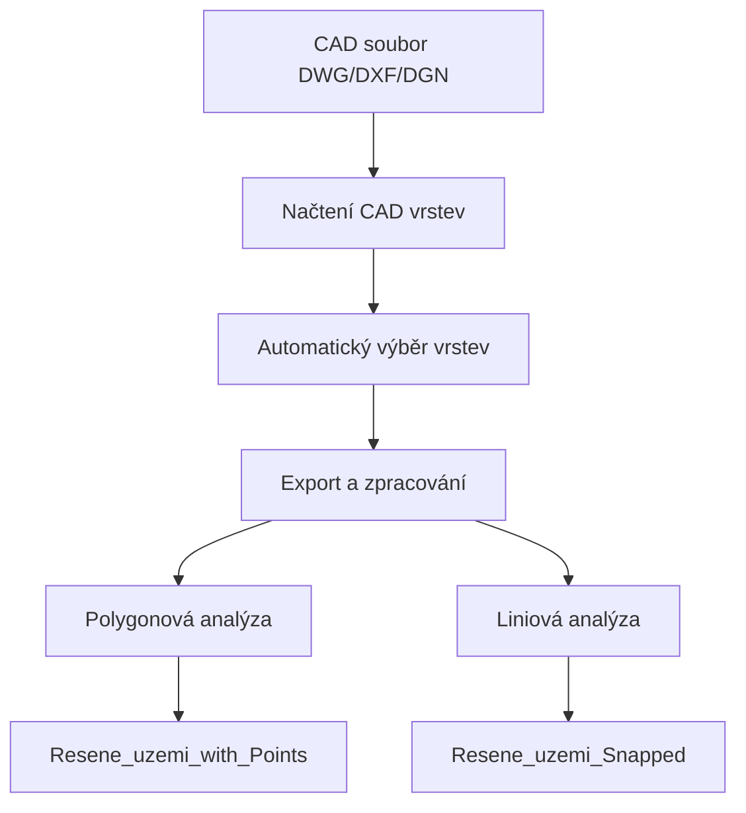

# CAD to GIS Import Toolbox - MADASPRU

Specializovaný Python toolbox pro ArcGIS Pro určený pro import a zpracování CAD dat s automatickou analýzou řešených území a částí území.

## 📋 Přehled

Tento toolbox automatizuje proces importu CAD souborů (DWG, DXF, DGN) do geodatabáze s pokročilými funkcemi pro zpracování:
- **Polyline vrstev** - automatické spojování a převod na polygony
- **Bodových vrstev** - prostorová analýza a hodnocení kvality
- **Spatial join analýzy** - propojení bodů s polygony
- **Geometrické úpravy** - integrate, snap operace

## 🎯 Hlavní funkce

### Automatické zpracování vrstev
- **101110_PL_Resene_uzemi** (Polyline) - řešené území
- **200000_PL_Cast_uzemi** (Polyline) - části území
- **101111_BL_Resene_uzemi** (Point) - kontrolní bod řešeného území
- **202110_BL_Cast_uzemi_UP** (Point) - územní plán
- **203110_BL_Cast_uzemi_SB** (Point) - stavební bloky
- **204110_BL_Cast_uzemi_NB** (Point) - nadzemní budovy
- **205110_BL_Cast_uzemi_XB** (Point) - ostatní budovy

### Pokročilé zpracování
1. **Merge a Feature to Polygon** - spojení polyline vrstev do polygon
2. **Integrate** - geometrické čištění s tolerancí 30 cm
3. **Spatial Join** - připojení bodových atributů k polygonům
4. **Snap operace** - přichycení linií k finálním polygonům
5. **Hodnocení kvality** - automatické označení stavu bodových dat

## 🛠️ Instalace

### Požadavky
- ArcGIS Pro 2.8 nebo novější
- Python 3.x (součást ArcGIS Pro)
- Licenční úroveň Standard nebo Advanced (pro některé funkce)

### Postup instalace
1. Stáhněte soubor `Prevodnik_CAD_GIS_Madaspru.pyt`
2. Zkopírujte do složky s vaším ArcGIS Pro projektem
3. V ArcGIS Pro přidejte toolbox:
   - Catalog Pane → Toolboxes → Add Toolbox
   - Vyberte `Prevodnik_CAD_GIS_Madaspru.pyt`

## 📖 Použití

### Základní workflow



### Parametry toolboxu

| Parametr | Typ | Popis | Výchozí hodnota |
|----------|-----|-------|-----------------|
| **Input CAD Soubor** | DEFile | Cesta k CAD souboru (DWG/DXF/DGN) | - |
| **CAD Vrstva(y)** | GPString | Vybrané vrstvy (automaticky předvybrané) | Auto |
| **Output Geodatabáze** | DEWorkspace | Cílová geodatabáze | - |
| **Output Feature Dataset** | GPString | Název feature datasetu (volitelné) | - |
| **XY Tolerance** | GPDouble | Tolerancia v metrech | 0.01 m |
| **XY Resolution** | GPDouble | Rozlišení v metrech | 0.001 m |
| **Output Souřadnicový Systém** | GPSpatialReference | Cílový souřadnicový systém | Auto z CAD |
| **Geographic Transformation** | GPString | Transformace souřadnic (volitelné) | - |
| **Prefix jména výstupu** | GPString | Prefix pro názvy výstupních vrstev | - |

### Spuštění toolboxu

1. **Otevřete toolbox** v ArcGIS Pro
2. **Spusťte tool "Import CAD do GIS"**
3. **Nastavte parametry:**
   - Vyberte CAD soubor
   - Zvolte výstupní geodatabázi
   - (Volitelně) nastavte feature dataset a další parametry
4. **Spusťte tool** - vrstvy se automaticky předvyberou
5. **Ověřte výsledky** v geodatabázi

## 📊 Výstupní vrstvy

### Polygonová analýza
- **`Resene_uzemi_with_Points`** - hlavní polygonová vrstva s analýzou bodů
  - Pole `Join_Count` - počet připojených bodů
  - Pole `bod` - hodnocení ("v pořádku", "bez bodu", "více bodů")

### Liniová analýza  
- **`Resene_uzemi_Snapped`** - linie řešeného území přichycená k polygonu
  - Pole `bod` - hodnocení bodu řešeného území

### Původní vrstvy (zachované)
- **`101110_PL_Resene_uzemi_LN`** - původní linie řešeného území
- **`200000_PL_Cast_uzemi_LN`** - původní linie částí území
- **`101111_BL_Resene_uzemi_PT`** - původní bod řešeného území
- **Bodové vrstvy** - všechny původní bodové vrstvy částí území

## 🔍 Hodnocení kvality dat

### Pole "bod" - hodnocení
| Hodnota | Význam | Popis |
|---------|---------|-------|
| **"v pořádku"** | Join_Count = 1 | Polygon/linie má přiřazen právě jeden bod |
| **"bez bodu"** | Join_Count = 0 | Polygon/linie nemá přiřazen žádný bod |
| **"více bodů"** | Join_Count > 1 | Polygon/linie má přiřazeno více bodů |

### Statistický výstup
Tool automaticky zobrazí statistiky zpracování:
```
Analýza dokončena:
- Celkem polygonů: 36
- V pořádku (1 bod): 34  
- Bez bodu: 2
- Více bodů: 0
```

## ⚙️ Pokročilá konfigurace

### Tolerancie a rozlišení
- **XY Tolerance**: 0.01 m (doporučeno pro katastrální přesnost)
- **XY Resolution**: 0.001 m (milimetrová přesnost)
- **Integrate Tolerance**: 0.3 m (pevně nastaveno v kódu)
- **Snap Tolerance**: 1.0 m (pro přichycení linií)

### Souřadnicové systémy
- Tool automaticky detekuje souřadnicový systém z CAD souboru
- Podporuje automatickou reprojekci při odlišných systémech
- Možnost manuálního nastavení cílového systému

## 🐛 Řešení problémů

### Časté chyby

**"ERROR 002852: Feature class already exists"**
- Řešení: Tool automaticky generuje unikátní názvy, zkuste smazat staré vrstvy

**"Cannot find field 'bod'"**
- Řešení: Opraveno v aktuální verzi, update toolbox

**Prázdné výstupy**
- Zkontrolujte názvy vrstev v CAD souboru
- Ověřte, že vrstvy obsahují data
- Zkontrolujte souřadnicový systém

### Logování
Tool poskytuje detailní logy v ArcGIS Pro:
- `[export]` - export jednotlivých vrstev
- `[process_polylines_to_polygon]` - zpracování polygon
- `[perform_spatial_join_analysis]` - prostorová analýza
- `[snap_resene_line_to_polygon]` - přichycení linií

## 📈 Výkonnost

### Doporučení
- **Velikost dat**: Testováno na CAD souborech do 50 MB
- **Počet prvků**: Optimalizováno pro tisíce polygonů/bodů
- **Čas zpracování**: 2-10 minut podle složitosti dat

### Optimalizace
- Používejte SSD disky pro dočasné soubory
- Uzavřete zbytečné aplikace během zpracování
- Pro velké datasety zvažte dělení na menší části

## 🔄 Changelog

### Verze 1.0 (Září 2025)
- ✅ Základní import CAD vrstev
- ✅ Automatické předvybrání specifických vrstev
- ✅ Polyline zpracování (merge → polygon → integrate)
- ✅ Spatial join analýza bodových vrstev
- ✅ Snap operace pro přichycení linií
- ✅ Hodnocení kvality dat

## 🤝 Přispívání

1. Fork tohoto repository
2. Vytvořte feature branch (`git checkout -b feature/AmazingFeature`)
3. Commitněte změny (`git commit -m 'Add some AmazingFeature'`)
4. Push do branch (`git push origin feature/AmazingFeature`)
5. Otevřete Pull Request

## 📝 Licence

Tento projekt je licencován pod [MIT License](LICENSE).

## 👨‍💻 Autoři

- **Vývojář**: GitHub Copilot & Uživatel
- **Testování**: MADASPRU projekt
- **Organizace**: CityDeal

## 📞 Kontakt

Pro otázky a podporu:
- 📧 Email: [váš-email@domain.com]
- 🐛 Issues: [GitHub Issues](../../issues)
- 📖 Wiki: [GitHub Wiki](../../wiki)

---
*Poslední aktualizace: Září 2025*
