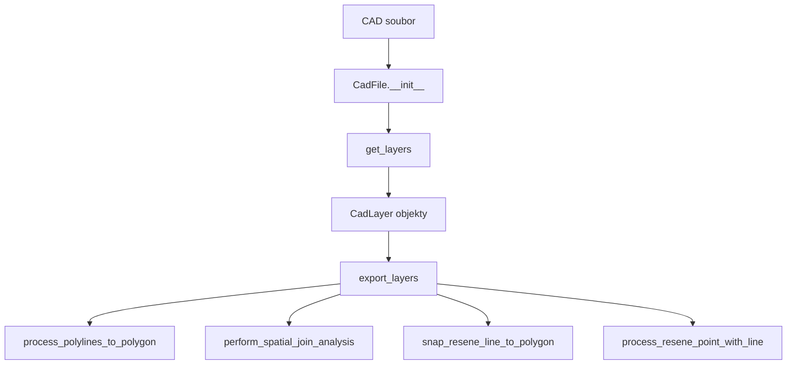

# Technická dokumentace - CAD to GIS Toolbox

## 🏗️ Architektura

### Struktura kódu

```
Prevodnik_CAD_GIS_Madaspru.pyt
├── Pomocné funkce
│   ├── parameter() - tvorba parametrů toolboxu
│   ├── get_all_fc_names() - získání názvů feature classes
│   └── generate_unique_fc_name() - generování unikátních názvů
├── Třídy
│   ├── CadLayer - reprezentace CAD vrstvy
│   ├── CadFile - reprezentace CAD souboru
│   ├── Toolbox - definice toolboxu
│   └── ExportLayer - hlavní export tool
└── Konstanty
    └── GEOMETRY_SUFFIX - přípony pro typy geometrie
```

### Datový tok



## 🔧 Klíčové metody

### CadLayer.export()
**Účel**: Export jedné CAD vrstvy do geodatabáze

**Parametry**:
- `output_workspace` - cílový workspace
- `new_name` - nový název (volitelný)
- `spatial_ref` - souřadnicový systém
- `transform_method` - transformační metoda
- `out_prefix` - prefix názvu

**Algoritmus**:
1. Validace názvu feature class
2. Kontrola jedinečnosti názvu v geodatabázi
3. SQL filtrování podle vrstvy
4. Export pomocí FeatureClassToFeatureClass
5. Definice a reprojekce souřadnicového systému

**Výstup**: Cesta k exportované feature class nebo None

### CadFile.export_layers()
**Účel**: Orchestrace exportu všech vybraných vrstev

**Klíčová logika**:
```python
# Kategorizace vrstev podle typu
if is_special_polyline:
    polylines_for_merge.append(exported)
elif is_special_point:
    point_layers_for_join.append(exported)
elif is_resene_point:
    resene_point_fc = exported
else:
    exported_layers.append(exported)
```

**Workflow**:
1. Export jednotlivých vrstev
2. Speciální zpracování polyline vrstev
3. Spatial join analýza bodových vrstev
4. Snap operace a liniová analýza

### process_polylines_to_polygon()
**Účel**: Převod polyline vrstev na polygony s geometrickým čištěním

**Algoritmus**:
```python
1. Merge([polyline1, polyline2]) → merged_polylines
2. FeatureToPolygon(merged_polylines) → polygon
3. Integrate(polygon, tolerance=0.3m) → cleaned_polygon
4. Delete(merged_polylines) # cleanup
```

**Tolerancie**:
- **Integrate tolerance**: 0.3 metru (30 cm)
- **Cluster tolerance**: "" (výchozí)

### perform_spatial_join_analysis()
**Účel**: Prostorová analýza bodů s polygony

**Algoritmus**:
```python
1. Merge(point_layers) → merged_points
2. SpatialJoin(polygons, merged_points, "JOIN_ONE_TO_ONE") → joined
3. AddField(joined, "bod", "TEXT")
4. UpdateCursor: hodnocení podle Join_Count
   - Join_Count = 0 → "bez bodu"
   - Join_Count = 1 → "v pořádku"  
   - Join_Count > 1 → "více bodů"
```

**Spatial Join parametry**:
- `join_operation`: "JOIN_ONE_TO_ONE"
- `join_type`: "KEEP_ALL"
- `match_option`: "CONTAINS"

### snap_resene_line_to_polygon()
**Účel**: Přichycení původní linie k finálnímu polygonu

**Algoritmus**:
```python
1. PolygonToLine(polygon) → polygon_lines
2. CopyFeatures(original_line) → temp_line
3. Snap(temp_line, [[polygon_lines, "EDGE", "1 Meters"]])
4. CopyFeatures(temp_line) → final_snapped_line
```

**Snap parametry**:
- **Snap type**: "EDGE"
- **Snap tolerance**: 1.0 metr

### process_resene_point_with_line()
**Účel**: Analýza bodu řešeného území s přichycenou linií

**Algoritmus**:
```python
1. FeatureToPolygon(snapped_line) → temp_polygon
2. SpatialJoin(temp_polygon, resene_point) → joined_polygon
3. Hodnocení podle Join_Count
4. AddField(snapped_line, "bod") 
5. UpdateCursor: kopírování hodnocení do linie
```

## 🔍 Geometrické operace

### Integrace (Integrate)
**Účel**: Čištění geometrie a odstranění drobných nepřesností

**Parametry**:
- **Tolerance**: 0.3 metru
- **Input**: Polygonová vrstva
- **Výsledek**: Geometricky vyčištěné polygony

**Vliv na data**:
- Spojení vrcholů vzdálených < 30 cm
- Vyhlazení drobných nerovností
- Možné mírné posuny geometrie

### Snap operace
**Účel**: Přichycení geometrie k referenčním prvkům

**Parametry**:
```python
snap_env = [[reference_layer, "EDGE", "1 Meters"]]
```

**Typy snap**:
- **EDGE**: Přichycení k hranám
- **VERTEX**: Přichycení k vrcholům  
- **END**: Přichycení ke koncům linií

### Spatial Join
**Účel**: Připojení atributů na základě prostorových vztahů

**Typy připojení**:
- **JOIN_ONE_TO_ONE**: Jeden k jednomu (preferovaný)
- **JOIN_ONE_TO_MANY**: Jeden k mnoha (pro počítání)

**Match options**:
- **CONTAINS**: Bod uvnitř polygonu
- **INTERSECT**: Překryv geometrií
- **WITHIN_A_DISTANCE**: V určité vzdálenosti

## 📊 Správa paměti

### Dočasné soubory
Tool využívá `in_memory` workspace pro dočasné operace:

```python
temp_polygon = "in_memory\\temp_polygon"
temp_join = "in_memory\\temp_join"
```

**Výhody**:
- Rychlejší operace (RAM vs disk)
- Automatické čištění při ukončení
- Menší nároky na diskové místo

**Čištění**:
```python
arcpy.Delete_management(temp_polygon)
arcpy.Delete_management(temp_join)
```

### Optimalizace výkonu

**Doporučení**:
- Používejte SSD disky pro geodatabáze
- Nastavte adequátní `arcpy.env.workspace`
- Omezujte počet dočasných souborů
- Využívajte `in_memory` pro malé datasety

## 🛡️ Error handling

### Strategie zacházení s chybami

```python
try:
    # Kritická operace
    result = process_data()
    if result:
        exported_layers.append(result)
except Exception as e:
    arcpy.AddError(f"Chyba při zpracování: {e}")
    # Fallback nebo clean exit
    return None
```

### Typy chyb

**Runtime chyby**:
- Chybějící feature classes
- Neplatné geometrie
- Licenční omezení

**Data chyby**:
- Prázdné vrstvy
- Nekompatibilní souřadnicové systémy
- Poškozené CAD soubory

**System chyby**:
- Nedostatek místa na disku
- Nedostatek paměti
- Přístupová práva

### Logování

```python
arcpy.AddMessage(f"[method_name] Informační zpráva")
arcpy.AddWarning(f"[method_name] Varování: {warning}")
arcpy.AddError(f"[method_name] Chyba: {error}")
```

## 🔄 Workflow optimalizace

### Paralelizace
Současná implementace je sekvenční. Možné optimalizace:

```python
# Současné (sekvenční)
for layer in layers:
    process_layer(layer)

# Možné (paralelní)
from multiprocessing import Pool
with Pool() as pool:
    results = pool.map(process_layer, layers)
```

**Omezení**:
- ArcGIS Pro licenční omezení
- Zamykání geodatabáze
- Komplexnost error handling

### Caching
Možné implementace cache pro opakované operace:

```python
@lru_cache(maxsize=128)
def get_spatial_reference(cad_file):
    return arcpy.Describe(cad_file).spatialReference
```

## 🧪 Testování

### Unit testy
Doporučená struktura testů:

```python
class TestCadLayer(unittest.TestCase):
    def setUp(self):
        self.test_cad = "test_data.dwg"
        self.test_workspace = "test.gdb"
    
    def test_export_valid_layer(self):
        # Test exportu platné vrstvy
        pass
    
    def test_export_empty_layer(self):
        # Test exportu prázdné vrstvy
        pass
```

### Integrační testy
```python
def test_full_workflow():
    # Test kompletního workflow od CAD po finální vrstvy
    input_cad = "test_complete.dwg"
    result = run_complete_workflow(input_cad)
    assert len(result) > 0
    assert "Resene_uzemi_with_Points" in result
```

### Test data
Doporučené testovací datasety:
- **Minimální CAD** - základní geometrie
- **Komplexní CAD** - všechny typy vrstev
- **Poškozený CAD** - test error handling
- **Velký CAD** - test výkonnosti

## 📋 Kontrolní seznamy

### Pre-commit checklist
- [ ] Všechny funkce mají docstring
- [ ] Error handling implementován
- [ ] Testovací data připravena
- [ ] Výkonnostní profiling proveden
- [ ] Dokumentace aktualizována

### Release checklist
- [ ] Všechny testy prochází
- [ ] Dokumentace kompletní
- [ ] Changelog aktualizován
- [ ] Verze označena v kódu
- [ ] GitHub release vytvořen

---
*Technická dokumentace - verze 1.0*
